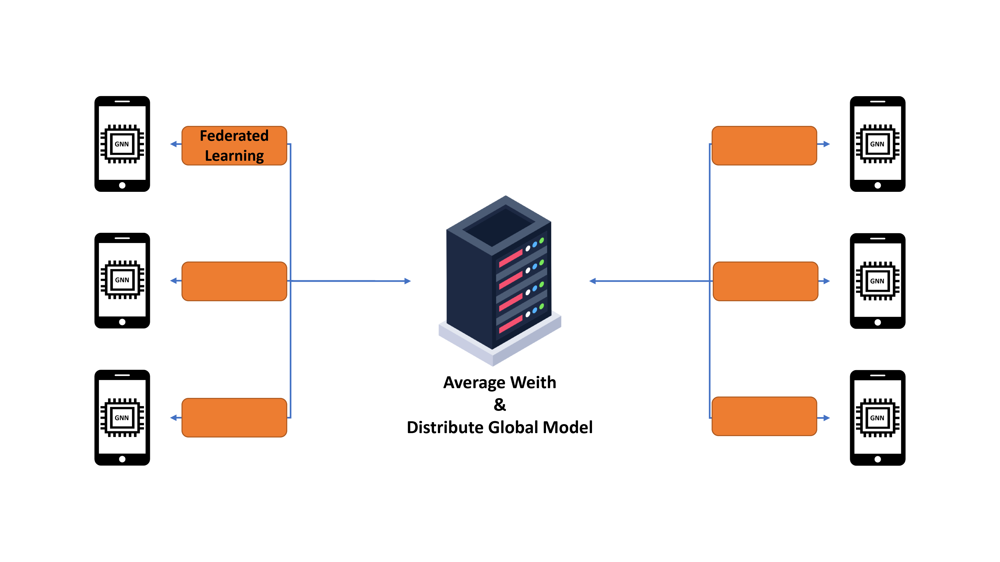

# Graph-Neural-Network-based-Federated-Learning-for-Heterogenous-Device-Network

## Overview
This is the Simulation code for Dynamic Federated Learning for Heterogenous Device Using Graph Neural Network

Federated learning has made it possible to learn models using distributed computing resources. The most commonly
used, Fedavg method has a simple structure and shows good performance. However, Fedavg has the disadvantage of not
considering the performance of each user device in real-time. To solve this problem, we propose GDFed. It is a federated
learning structure that understands the performance and realtime status of each user device during proceeds learning. GNN
learns from the graph-type dataset and can perform tasks such as node clustering or node classification through the feature of
each node (in this case, the device). GDFed is an architecture that clusters devices using pre-trained GNN models and proceeds with
federated learning, taking into account the current capabilities of each device. In the experiment, we show the GDFed method
outperforms the Fedavg method by 43.3% in reducing the delay time.

## 버전정보
Python 3.8
Pytorch 1.12.1
dgl-cuda11.3 0.9.1

## License
Copyright (c) 2021 Networking Intelligence
Redistribution and use in source and binary forms, with or without modification, are permitted provided that the following conditions are met:

1. Redistributions of source code must retain the above copyright notice, this list of conditions and the following disclaimer.

2. Redistributions in binary form must reproduce the above copyright notice, this list of conditions and the following disclaimer in the documentation and/or other materials provided with the distribution.

THIS SOFTWARE IS PROVIDED BY THE COPYRIGHT HOLDERS AND CONTRIBUTORS "AS IS" AND ANY EXPRESS OR IMPLIED WARRANTIES, INCLUDING, BUT NOT LIMITED TO, THE IMPLIED WARRANTIES OF MERCHANTABILITY AND FITNESS FOR A PARTICULAR PURPOSE ARE DISCLAIMED. IN NO EVENT SHALL THE COPYRIGHT HOLDER OR CONTRIBUTORS BE LIABLE FOR ANY DIRECT, INDIRECT, INCIDENTAL, SPECIAL, EXEMPLARY, OR CONSEQUENTIAL DAMAGES (INCLUDING, BUT NOT LIMITED TO, PROCUREMENT OF SUBSTITUTE GOODS OR SERVICES; LOSS OF USE, DATA, OR PROFITS; OR BUSINESS INTERRUPTION) HOWEVER CAUSED AND ON ANY THEORY OF LIABILITY, WHETHER IN CONTRACT, STRICT LIABILITY, OR TORT (INCLUDING NEGLIGENCE OR OTHERWISE) ARISING IN ANY WAY OUT OF THE USE OF THIS SOFTWARE, EVEN IF ADVISED OF THE POSSIBILITY OF SUCH DAMAGE.
